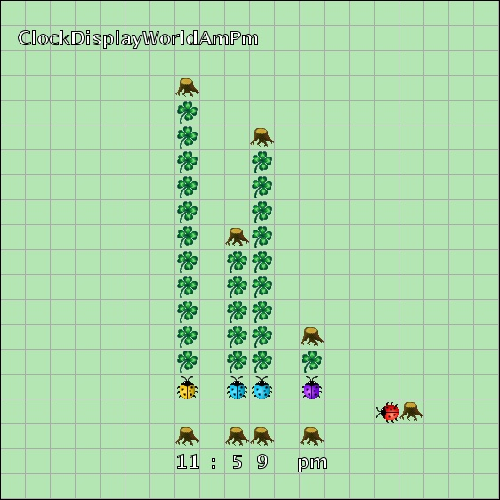

# Kara ClockDisplay

This ([kara-clock](./kara-clock)) is the lab scaffold for a Kara Version of the ClockDisplay example shown in Chapter 3 in the Textbook Barnes, D.J. and Kölling, M. (2017) **Objects First with Java: A Practical Introduction Using Bluej.* 6th, global edn. Boston: Pearson Education.

([https://www.bluej.org/objects-first/](https://www.bluej.org/objects-first/))

## More Info

- Info1: https://home.htw-berlin.de/~kleinen/info1/
- [Labs Overview](https://home.htw-berlin.de/~kleinen/classes/ws2023/info1/labs/)
- [Kara ClockDisplay Exercises Overview](https://home.htw-berlin.de/~kleinen/classes/ws2023/info1/labs/karaclock-complete/)
- [ClockDisplay Refactoring](https://home.htw-berlin.de/~kleinen/material/info1/clock_display_refactoring/)

